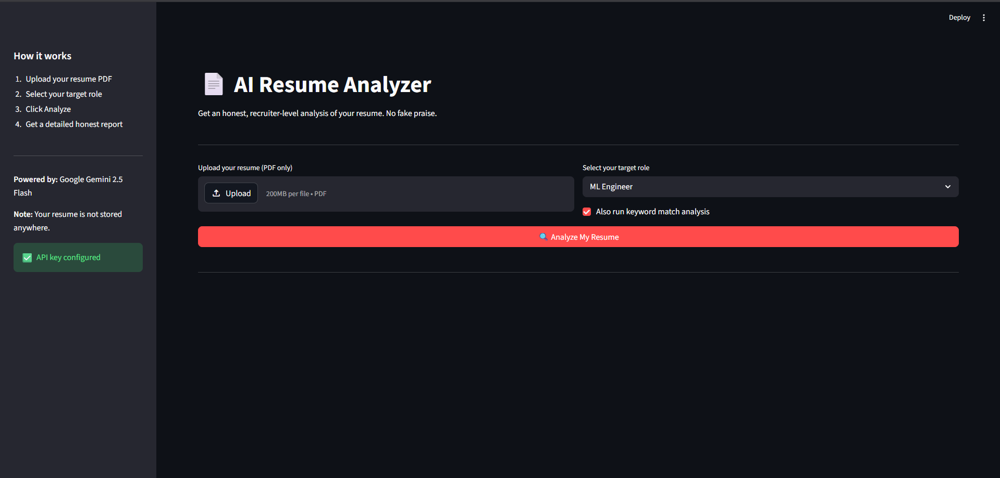

# AI Resume Analyzer

An honest, recruiter-level resume analyzer built with Python, Streamlit, and Google Gemini.
Upload your resume PDF and get a detailed breakdown of what's actually wrong with it.

No fake praise. No generic advice. Just real feedback.

---

## What it does

- Extracts text from resume PDFs (pdfplumber + PyPDF2 fallback)
- Runs keyword match analysis against your target role
- Sends resume to Google Gemini 1.5 Flash with a structured recruiter prompt
- Returns scored analysis across 11 sections including ATS issues, bullet rewrites, and a hiring roadmap
- Lets you download the full report as a `.txt` file

---

## Screenshots



---

## Tech Stack

Python · Streamlit · Google Gemini 1.5 Flash · pdfplumber · PyPDF2 · python-dotenv

---

## Setup

### 1. Clone the repo
```bash
git clone https://github.com/YOUR_USERNAME/resume-analyzer.git
cd resume-analyzer
```

### 2. Create a virtual environment
```bash
python -m venv venv
venv\Scripts\activate      # Windows
source venv/bin/activate   # Mac/Linux
```

### 3. Install dependencies
```bash
pip install -r requirements.txt
```

### 4. Get a free Gemini API key
1. Go to https://aistudio.google.com/app/apikey
2. Create a new API key
3. Copy it

### 5. Set up your `.env` file
```bash
cp .env.example .env
```
Edit `.env` and add:
```
GEMINI_API_KEY=your_key_here
```

### 6. Run the app
```bash
streamlit run app.py
```

Opens at `http://localhost:8501`

---

## Project Structure

```
resume-analyzer/
├── app.py           # Streamlit UI
├── analyzer.py      # Gemini API calls
├── prompts.py       # Prompt templates
├── pdf_parser.py    # PDF text extraction
├── utils.py         # Score helpers and validators
├── requirements.txt
├── .env.example
└── README.md
```

---

## Notes

- Your resume is never stored — analysis happens entirely in memory
- Gemini 1.5 Flash is free tier friendly (~$0.002 per analysis)
- Resumes are truncated to 4000 characters to keep costs low
- Works best with text-based PDFs, not scanned images